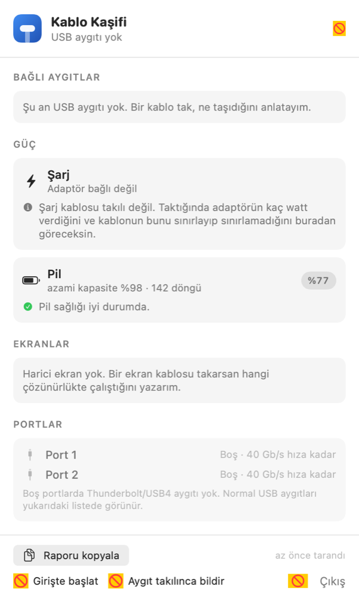

# Kablo Kaşifi 🔌🔍

Mac'ine taktığın USB-C kablosunun **gerçekte ne yapabildiğini** düz Türkçe anlatan menü
çubuğu uygulaması. Aynı görünen iki kablodan biri 40 Gb/s veri ve 100 W güç taşırken
diğeri sadece şarj edebilir — bu uygulama hangisinin elinde olduğunu söyler.

[](https://github.com/ns-koroglu/kablo-kasifi/releases)
[](LICENSE)
macOS 14+ · Apple Silicon ve Intel · SwiftUI



---

## Ne söyler

**Bağlı aygıtlar.** Her USB aygıtının gerçek bağlantı hızı ve bunun ne anlama geldiği.
Asıl marifeti **darboğazı doğru adreslemesi**: aygıtın kendi yeteneğini (`bcdUSB`)
gerçekleşen bağlantı hızından (`UsbLinkSpeed`) ayrı okuduğu için suçu yanlış yere atmaz.

> *"Aygıtın kendisi USB 2.0 — 480 Mb/s onun tavanı. Kablo veya port suçlu değil."*
> *"Aygıt USB 3.x destekliyor ama 480 Mb/s'de bağlı. Sınırlayan, üstündeki USB2.1 Hub."*
> *"Kablon büyük ihtimalle sadece şarj/USB 2.0 kablosu — veri kablosuyla 10 kat hızlanır."*

Hub'ın altındaki aygıtlar **girintiyle** gösterilir; hangi aygıtın neyin arkasında
olduğu tek bakışta görünür.

**Güç.** Adaptörün etiket gücü ile fiilen anlaşılan gücü (V × A) karşılaştırır:

> *"96 W adaptör tam güçte veriyor (94 W anlaşıldı). Kablo bu gücü sorunsuz taşıyor."*
> *"Adaptör 67 W ama yalnızca 28 W geliyor. Kablo düşük güçlü (60 W sınırlı) olabilir."*
> *"Pil %92 olduğu için Mac az güç istiyor; bu normal."* ← boş yere alarm vermez

Ayrıca pil yüzdesi, azami kapasite, döngü sayısı ve adaptörün sunduğu USB-PD profilleri.

**Portlar ve ekranlar.** Thunderbolt/USB4 portlarının durumu; harici ekran varsa
kablonun görüntü taşıdığı ve hangi çözünürlük/tazeleme hızında çalıştığı.

**Anlık.** Yoklama yok: güç değişimi, USB tak/çıkar ve ekran değişimi olayları geldiği
anda işlenir. **Menü çubuğundaki watt değeri panel kapalıyken de canlıdır.**

**Bildirim.** Yeni aygıt takıldığında, panel kapalı olsa bile asıl yorum bildirim olarak
gelir. Alt satırdaki anahtarla kapatılır.

**Raporu kopyala.** Panelin tamamını düz metin olarak panoya alır — "bu kablo neden
yavaş?" diye birine sorarken yapıştırman yeter.

---

## Kurulum

### Hazır paket

[Releases](https://github.com/ns-koroglu/kablo-kasifi/releases) sayfasından `.zip`'i
indir, `Kablo Kaşifi.app`'i `/Applications`'a taşı, **sağ tık → Aç** de.

Notarize edilmediği için macOS ilk açılışta uyarı gösterir. Sağ tık → Aç ile geçilir;
alternatif olarak:

```bash
xattr -dr com.apple.quarantine "/Applications/Kablo Kaşifi.app"
```

### Kaynaktan

```bash
./build.sh --install --run
```

**Özel izin gerektirmez.** Yalnızca bildirimleri açık bırakırsan macOS bir kez bildirim
izni sorar.

Terminalden hızlı bakış:

```bash
"/Applications/Kablo Kaşifi.app/Contents/MacOS/KabloKasifi" --print
```

İstersen ad-hoc yerine sabit bir yerel imza kimliğiyle imzalayabilirsin
(`./Scripts/setup-signing.sh` — bir kez yeter; `build.sh` varsa onu kullanır).

---

## Diller

🇹🇷 Türkçe (varsayılan) · 🇬🇧 English · 🇩🇪 Deutsch · 🇪🇸 Español · 🇫🇷 Français ·
🇮🇹 Italiano · 🇵🇹 Português · 🇷🇺 Русский · 🇨🇳 简体中文 · 🇯🇵 日本語

Açılışta **sistem diline** göre ayarlanır; sistem dili bu onun dışındaysa **Türkçe**
kullanılır. Elle seçmek için panelin alt satırındaki 🌐 düğmesini kullan.

Çeviriler `Sources/KabloKasifi/Localization/` altında, dil başına tek dosya. Metinler
tek bir `struct` üzerinden tutulduğu için **eksik çeviri mümkün değil**: yeni bir metin
eklendiğinde çeviri dosyaları derlenmez.

---

## Nasıl çalışıyor

Veriler mümkün olan her yerde **native API'lerden** okunur; bunlar macOS sürümleri
arasında değişmediği için uygulama sürüm güncellemelerine dayanıklıdır:

| Bilgi | Kaynak |
|---|---|
| USB aygıtları, hız, USB sürümü, hub ağacı | IOKit — `IOUSBHostDevice` (`UsbLinkSpeed`, `bcdUSB`, `locationID`) |
| Şarj adaptörü, voltaj/akım, PD profilleri, pil | IOKit — `AppleSmartBattery` / `AdapterDetails` |
| Harici ekranlar | CoreGraphics — `CGGetOnlineDisplayList` |
| Değişiklik bildirimleri | `IOPSNotificationCreateRunLoopSource`, `IOServiceAddMatchingNotification` |
| Thunderbolt port durumu | `system_profiler` (tip adı çalışma anında keşfedilir) |

### macOS sürüm dayanıklılığı

Bu uygulamanın ilk sürümü `system_profiler SPUSBDataType` kullanıyordu ve **macOS 26'da
hiçbir USB aygıtını göremiyordu**: Apple bu veri tipini `SPUSBHostDataType` olarak
yeniden adlandırmış, `system_profiler` de var olmayan tip için hata vermek yerine
sessizce boş dizi döndürüyordu.

Alınan dersler koda işlendi:

1. Kritik veriler `system_profiler` yerine IOKit/CoreGraphics'ten okunuyor.
2. `system_profiler` gereken tek yerde (Thunderbolt) veri tipi adı
   `system_profiler -listDataTypes` ile **çalışma anında** doğrulanıyor.
3. Bir kaynak okunamazsa bölüm sessizce boş kalmıyor — panelde turuncu uyarı çıkıyor.
4. Alt sürece zaman aşımı var: takılan bir `system_profiler` tüm taramaları kilitliyordu.
5. `--doctor` bayrağı hangi kaynağın çalıştığını tek bakışta gösteriyor:

```bash
"/Applications/Kablo Kaşifi.app/Contents/MacOS/KabloKasifi" --doctor
```

```
macOS: Version 26.6.2 (Build 25G83)
USB (IOKit)            : 4 aygıt
Güç (IOKit)            : 96W USB-C Power Adapter
Ekran (CoreGraphics)   : 0 harici
Thunderbolt            : SPThunderboltDataType → 2 veri yolu
  ✗ SPUSBDataType
  ✓ SPUSBHostDataType
```

macOS 27'de bir veri tipi daha yeniden adlandırılırsa uygulama çalışmaya devam eder;
etkilenen tek bölüm uyarı gösterir ve `--doctor` sebebi söyler.

---

## Gizlilik

Hiçbir veri dışarı gönderilmez — kaynakta tek bir ağ çağrısı yok. Seri numaraları
(adaptör, pil, USB aygıtları) IOKit sözlüklerinde gelse de hiçbir yerde okunmaz ve
gösterilmez. Paket **hardened runtime** ile imzalanır.

---

## Dağıtım: notarization

```bash
./build.sh --notarize
```

Developer ID Application sertifikasıyla yeniden imzalar (hardened runtime + güvenli
zaman damgası) → Apple'a gönderip sonucu bekler → onayı pakete iliştirir
(`stapler staple`) → `spctl` ile doğrular → dağıtıma hazır `.zip` üretir.

Ön koşullar: Apple Developer Program üyeliği, anahtarlıkta *Developer ID Application*
sertifikası ve notarytool kimlik bilgisi:

```bash
xcrun notarytool store-credentials "app.kablokasifi.mac" --apple-id "posta@example.com" --team-id "ABCDE12345" --password "uygulamaya-özel-parola"
```

Parola, Apple kimliğinin normal parolası değil; [appleid.apple.com](https://appleid.apple.com)
üzerinden üretilen **uygulamaya özel paroladır**. Alternatif olarak `APPLE_ID`, `TEAM_ID`
ve `APP_PASSWORD` ortam değişkenleri kullanılabilir. Ön koşul yoksa betik durur ve
nedenini söyler.

---

## Kaldırma

```bash
osascript -e 'quit app "Kablo Kaşifi"'
rm -rf "/Applications/Kablo Kaşifi.app"
defaults delete app.kablokasifi.mac
```

"Girişte başlat" açıksa uygulamayı silmeden önce kapat, yoksa macOS'ta hayalet bir giriş
öğesi kalır (Sistem Ayarları → Genel → Giriş Öğeleri).

---

## Proje yapısı

```
Package.swift                      SwiftPM tanımı (SwiftUI + AppKit, macOS 14+)
build.sh                           Derleme, paketleme, imzalama, kurulum, notarization
Scripts/setup-signing.sh           Sabit yerel imza kimliği
Scripts/makeicon.swift             Simgeyi kodla çizer (1024px → .icns)
Resources/Info.plist               LSUIElement: menü çubuğu uygulaması
Sources/KabloKasifi/
  App/KabloKasifiApp.swift         MenuBarExtra sahnesi, canlı watt etiketi
  App/AppDelegate.swift            --print / --doctor / --render / --measure bayrakları
  Core/SystemProbe.swift           Veri toplama + Türkçe yorum motoru + rapor metni
  Core/USBProbe.swift              IOKit USB aygıt ağacı (hız, bcdUSB, hub ilişkisi)
  Core/PowerProbe.swift            IOKit adaptör/pil bilgisi (PD profilleri dahil)
  Core/LiveMonitor.swift           Güç/USB/ekran değişimlerini anında yakalayan bildirimler
  Core/Notifier.swift              Aygıt takılınca kullanıcı bildirimi
  Core/ProbeStore.swift            Durum, canlı yenileme, yeni aygıt algılama, kopyalama
  Models/Connection.swift          Satır, rol, kararlı kimlik ve yorum modelleri
  Localization/                    10 dil, dil başına tek dosya (KKStrings)
  Views/PanelView.swift            Menü çubuğu paneli
  Views/RenderPreview.swift        Paneli PNG'ye çizen geliştirme yardımcısı
```

### Geliştirme

```bash
swift build -c release
./.build/release/KabloKasifi --print               # terminalde özet
./.build/release/KabloKasifi --doctor              # veri kaynaklarının durumu
./.build/release/KabloKasifi --render /tmp/p.png   # paneli PNG olarak çiz
```

---

## In English

**Kablo Kaşifi** ("Cable Explorer") is a macOS menu bar app that tells you, in plain
language, what the USB-C cable you just plugged in can actually do: negotiated link speed
per device, whether a cable is limiting charging power (label watts vs. the volts × amps
actually negotiated, with the "battery is nearly full" case handled separately), whether
video is flowing, and the state of each Thunderbolt/USB4 port.

Because it reads each device's own `bcdUSB` capability alongside the negotiated
`UsbLinkSpeed`, it can tell you whether the bottleneck is the device, an intermediate hub,
or the cable. Devices behind a hub are shown indented. The menu bar wattage is live even
while the panel is closed — updates are push-based (`IOPSNotificationCreateRunLoopSource`,
`IOServiceAddMatchingNotification`), not polled — and a notification fires when a new
device is plugged in.

Native APIs are preferred over `system_profiler` deliberately: macOS 26 renamed
`SPUSBDataType` to `SPUSBHostDataType` and the old name silently returned an empty array,
so the first version saw no USB devices at all. Run `--doctor` to see which data source is
live on your macOS version.

Available in 10 languages, following your system language and falling back to Turkish.
No special permissions, nothing leaves your Mac.

Download from [Releases](https://github.com/ns-koroglu/kablo-kasifi/releases) or build
with `./build.sh --install --run` (macOS 14+).

MIT lisanslı.
